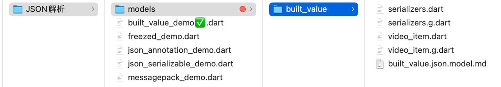

# 使用built_value解析json文件自动生成Model

* <font color=red>**不同的 json 解析库有不同的要求和范式，因此对应的模型类定义也会有所不同；**</font>

* **路径名中间不能包含中文**，否则执行脚本无法正常生成对应的代码；

* 一个项目最好统一用一个模型解析器。不同的模型解析可能会引发冲突；

* 具体来说，`freezed` 和 `built_value` 使用的方式和生成的代码有很大差异，因此模型类的定义方式也会不同；

* `built_value` 使用生成器来生成不可变类的代码，并且需要手动定义 builder 类。它使用工厂构造函数来创建实例，并且对序列化器有更复杂的要求；

* *video_item.dart*和*video_item.dart*可以是任意路径，但是必须关联在主文件*built_value_demo.dart*里面

  

  * *serializers.dart*
  
    ```dart
    import 'package:built_value/serializer.dart';
    import 'package:built_value/standard_json_plugin.dart';
    import 'package:built_collection/built_collection.dart';
    import 'video_item.dart';
    
    part 'serializers.g.dart';
    
    @SerializersFor(const [VideoItem, VideoList])
    final Serializers serializers = (_$serializers.toBuilder()
          ..addPlugin(StandardJsonPlugin()))
        .build();
    ```
  
  * *video_item.dart*
  
    ```dart
    import 'package:built_value/built_value.dart';
    import 'package:built_value/serializer.dart';
    import 'package:built_collection/built_collection.dart';
    
    part 'video_item.g.dart';
    
    abstract class VideoItem implements Built<VideoItem, VideoItemBuilder> {
      String? get nick_name;
      String? get head;
      String? get thread_id;
      String? get first_post_id;
      String? get create_time;
      String? get play_count;
      String? get post_num;
      String? get agree_num;
      String? get share_num;
      String? get has_agree;
      String? get freq_num;
      String? get forum_id;
      String? get title;
      String? get source;
      String? get weight;
      String? get extra;
      String? get abtest_tag;
      String? get thumbnail_width;
      String? get thumbnail_height;
      String? get video_md5;
      String? get video_url;
      String? get video_duration;
      String? get video_width;
      String? get video_height;
      String? get video_type;
      String? get thumbnail_url;
      String? get video_format;
      String? get thumbnail_picid;
      String? get video_from;
      String? get video_log_id;
      String? get auditing;
      String? get origin_video_url;
      String? get video_length;
      String? get video_size;
    
      VideoItem._();
      factory VideoItem([void Function(VideoItemBuilder) updates]) = _$VideoItem;
    
      static Serializer<VideoItem> get serializer => _$videoItemSerializer;
    }
    
    abstract class VideoList implements Built<VideoList, VideoListBuilder> {
      BuiltList<VideoItem> get list;
    
      VideoList._();
      factory VideoList([void Function(VideoListBuilder) updates]) = _$VideoList;
    
      static Serializer<VideoList> get serializer => _$videoListSerializer;
    }
    ```
  
  * 其中的`video_item.g.dart`和`serializers.g.dart`均为自动生成。生成路径与模型文件`video_item.dart`在同一文件夹[**生成方式如下**](#执行脚本自动生成代码)：
  
  * 配置*pubspec.yaml*
  
    ```yaml
    # flutter pub get
    # flutter pub upgrade -major-versions # 更新Flutter项目的依赖包到major版本
    # flutter pub outdated
    # open pub.dev
    
    name: jobs_flutter_base_config
    description: "A new Flutter project."
    publish_to: 'none' # Remove this line if you wish to publish to pub.dev
    version: 1.0.0+1
    environment:
      sdk: '>=3.3.1 <4.0.0'
    # 在dependencies部分中已经声明了某个包，就不需要在dev_dependencies部分重复声明了。
    dependencies: 
    # 核心库
      flutter: 
        sdk: flutter
    # 数据处理
      built_collection:
      built_value: # 用于序列化/反序列化数据
      built_value_generator: # 用于生成序列化/反序列化代码
      freezed: # 用于序列化/反序列化数据
      freezed_annotation: # 用于序列化/反序列化数据
    dev_dependencies:
      flutter_test:
        sdk: flutter
      flutter_lints: ^4.0.0 # Flutter代码规范
      build_runner:
    # For information on the generic Dart part of this file, see the
    # following page: https://dart.dev/tools/pub/pubspec
    flutter:
      uses-material-design: true # 指示应用程序是否应该使用Material Design风格
      # An image asset can refer to one or more resolution-specific "variants", see
      # https://flutter.dev/assets-and-images/#resolution-aware
      # For details regarding adding assets from package dependencies, see
      # https://flutter.dev/assets-and-images/#from-packages
      assets: # 路径名不能有中文，否则可能无法正常读取
        - assets/
        - assets/Jsons/data.json
    # For details regarding fonts from package dependencies,
    # see https://flutter.dev/custom-fonts/#from-packages
    # 
    # https://fonts.google.com/
    fonts:
      - family: Akrobat-Bold
        fonts:      
          - asset: assets/fonts/Akrobat-Bold.otf     
    ```
    
  * <font color=red>**主文件也不能有一点错否则无法成功生成代码，也可以先不写主文件**</font>
  
    *built_value_demo.dart*
    
    ```dart
    import 'package:flutter/material.dart';
    import 'dart:convert';
    import 'package:flutter/services.dart' show rootBundle;
    import 'video_item.dart';
    import 'serializers.dart';
    
    void main() {
      runApp(const MyApp());
    }
    
    class MyApp extends StatelessWidget {
      const MyApp({super.key});
    
      @override
      Widget build(BuildContext context) {
        return MaterialApp(
          title: 'Built Value JSON Parsing Demo',
          theme: ThemeData(
            primarySwatch: Colors.blue,
          ),
          home: const MyHomePage(),
        );
      }
    }
    
    class MyHomePage extends StatefulWidget {
      const MyHomePage({super.key});
    
      @override
      _MyHomePageState createState() => _MyHomePageState();
    }
    
    class _MyHomePageState extends State<MyHomePage> {
      List<VideoItem> _items = [];
    
      @override
      void initState() {
        super.initState();
        _loadData();
      }
    
      Future<void> _loadData() async {
        try {
          String jsonString = await rootBundle.loadString('assets/Jsons/data.json');
          final parsed = json.decode(jsonString);
          final videoList = serializers.deserializeWith(VideoList.serializer, parsed);
          setState(() {
            _items = videoList?.list.toList() ?? [];
          });
        } catch (e) {
          debugPrint('Error loading local JSON: $e');
        }
      }
    
      @override
      Widget build(BuildContext context) {
        return Scaffold(
          appBar: AppBar(
            title: const Text('Built Value JSON Parsing Demo'),
          ),
          body: ListView.builder(
            itemCount: _items.length,
            itemBuilder: (context, index) {
              final item = _items[index];
              return ListTile(
                leading: CircleAvatar(
                  backgroundImage: NetworkImage(item.head ?? ''),
                ),
                title: Text(item.title ?? 'No Title'),
                subtitle: Column(
                  crossAxisAlignment: CrossAxisAlignment.start,
                  children: [
                    Text('昵称: ${item.nick_name ?? 'Unknown'}'),
                    Text('播放次数: ${item.play_count ?? '0'}'),
                    Text('点赞次数: ${item.agree_num ?? '0'}'),
                  ],
                ),
                trailing: IconButton(
                  icon: const Icon(Icons.play_circle_fill),
                  onPressed: () {
                    // 播放视频的逻辑，例如跳转到视频播放页面
                  },
                ),
              );
            },
          ),
        );
      }
    }
    ```
    
  * <font id=执行脚本自动生成代码>进入项目根目录，执行：</font>
  
    ```shell
    flutter packages upgrade       
    flutter clean
    flutter pub get --no-example
    # flutter pub run build_runner build
    dart run build_runner build
    ```
    
    ```shell
    ➜  JobsFlutterBaseConfigDemo git:(main) ✗ flutter pub run build_runner build
    Deprecated. Use `dart run` instead.
    Building package executable... (1.0s)
    Built build_runner:build_runner.
    [INFO] Generating build script completed, took 458ms
    [INFO] Reading cached asset graph completed, took 282ms
    [INFO] Checking for updates since last build completed, took 1.7s
    [INFO] Running build completed, took 2.4s
    [INFO] Caching finalized dependency graph completed, took 196ms
    [INFO] Succeeded after 2.6s with 52 outputs (102 actions)
    ```
    
  * 错误解析 :
  
    **这个错误与 Flutter SDK 版本有关，特别是 Flutter 版本与某些依赖项之间的不兼容**
    
    ```shell
    Launching lib/JSON解析/built_value_demo.dart on iPhone 14 in debug mode...
    Xcode build done.                                           46.2s
    Failed to build iOS app
    Error (Xcode): ../../Flutter.sdk/Flutter.sdk_last/packages/flutter/lib/src/widgets/media_query.dart:257:116: Error: The getter 'supportsShowingSystemContextMenu' isn't defined for the class 'PlatformDispatcher'.
    
    Could not build the application for the simulator.
    Error launching application on iPhone 14.
    
    Exited (1).
    ```
    


